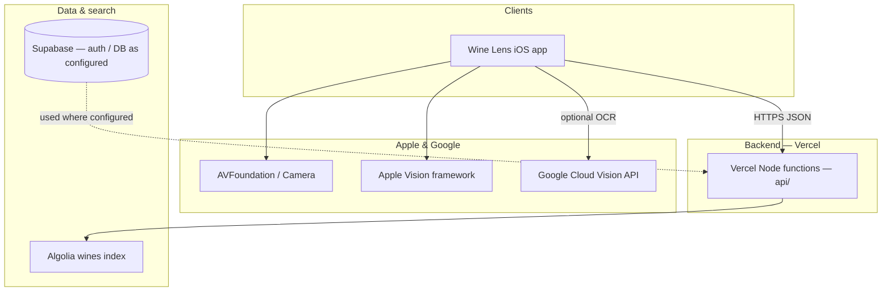
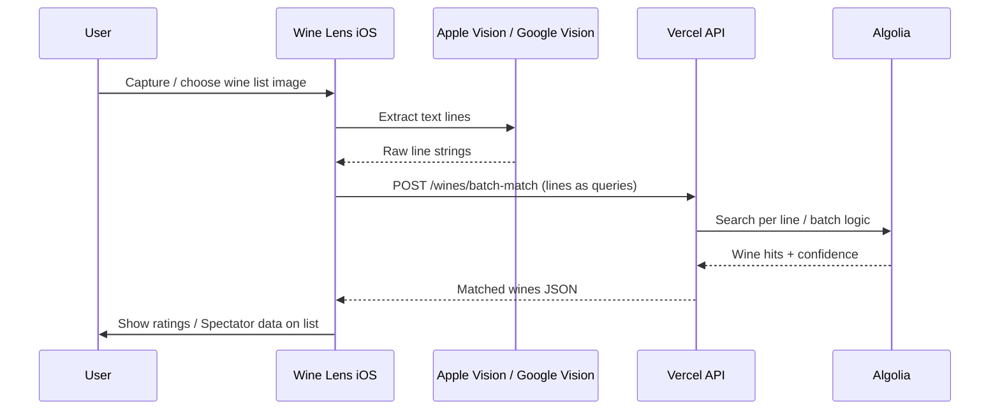
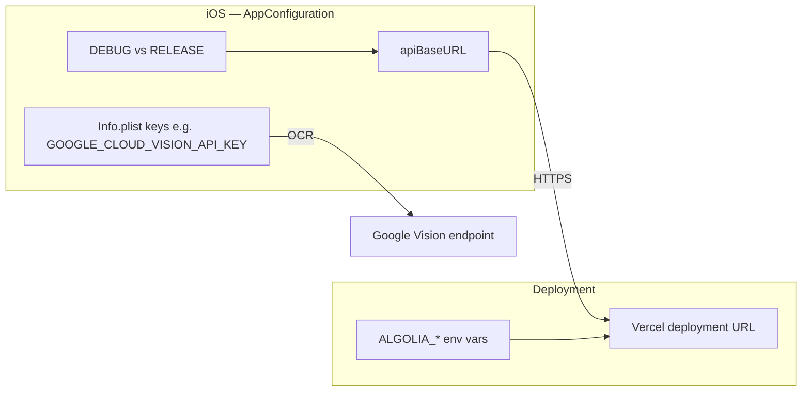
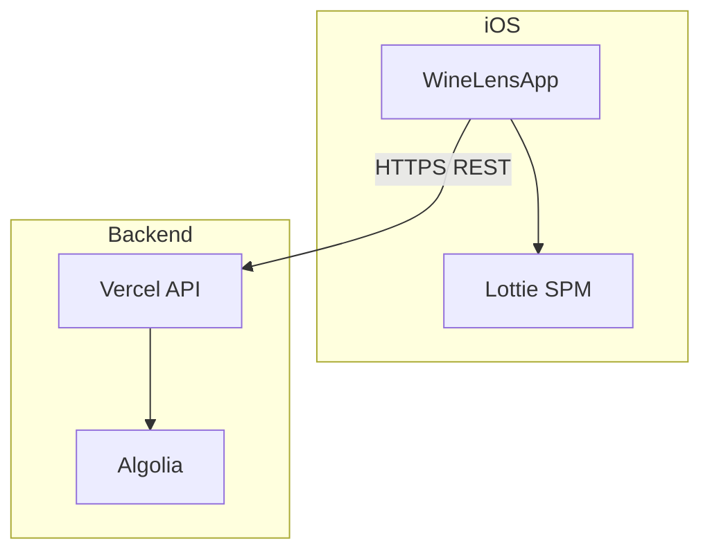

# Wine List Assistant — architecture & flow

High-level stack and how requests move through the system. For repo layout and Git/Xcode practices, see the [root README](../README.md).

---

## System context

**Stack summary**

| Layer | Technology |
|-------|------------|
| iOS UI | SwiftUI, iOS 18 target, Lottie (SPM) |
| On-device | Camera capture; OCR via Apple Vision and/or Google Cloud Vision |
| API | TypeScript on **Vercel** (`backend/api/`) |
| Search | **Algolia** (`wines` index) via `backend/lib/algolia.ts` |
| Data / auth | **Supabase** (per env; client may call additional routes as the app evolves) |

---

## Wine list scan → match (happy path)

**Related API routes in this repo (wines)**

| Method | Route | Role |
|--------|--------|------|
| GET | `/api/wines/search?q=…` | Fuzzy search with filters (color, vintage, min_score, …) |
| POST | `/api/wines/batch-match` | Match many OCR lines to wines in one call |
| GET | `/api/wines/[id]` | Single wine by id |

The iOS client (`WineAPIClient`) is also coded against paths such as **saved wines** and **subscription verify**; implement or stub those on the backend as your product completes those features.

---

## Configuration flow (environments)

Point the app’s **`apiBaseURL`** at your team’s Vercel preview or production host; avoid committing production secrets in source.

---

## Dependency direction

The mobile app does not talk to Algolia directly; credentials stay on the server. The app depends on **Lottie** via Swift Package Manager for animations.
